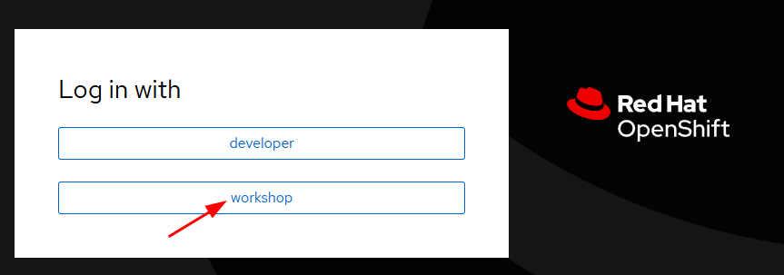

# [W01-18/6/2025] SL Workshop Guide 1

# Installation & Setup

In this section, we will:

1. Set up Tailscale (VPN)
2. Set up access to Openshift using oc cli 
3. Set up access to Openshift Console (GUI)

1. After installation of tailscale, run the command below in your host

```bash
# verify Tailscale
$ tailscale version
#1.84.0
  #tailscale commit: 160c11f37850a7e0a50f5efec48cacc333e69a00
  #other commit: bf604245899ff9c164ad9236bd52faab03a60faa
  #go version: go1.24.2
  
# linux
$ tailscale up --authkey <REPLACE WITH PROVIDED KEY>

# windows cmd
C:\users\foo> tailscale up --authkey <REPLACE WITH PROVIDED KEY>
```

1. On your terminal of choice, SSH into node running Openshift Local. *The credentials are standardized across all workshop attendees.* 
    
    Note: You must have access to the network using Tailscale as shown in step 1.
    
    ```bash
    $ ssh workshopuser@stardev-equinox
    # no password needed
    
    #The authenticity of host 'stardev-equinox (100.83.185.110)' can't be established.
    #ED25519 key fingerprint is SHA256:KIT8wMymQUblZcTEAW9O+lJAgR0CV16VTPHV0fEI/rI.
    #This key is not known by any other names.
    Are you sure you want to continue connecting (yes/no/[fingerprint])? yes
    #Warning: Permanently added 'stardev-equinox' (ED25519) to the list of known hosts.
    ```
    
2. As the workshopuser, run the oc login command below with your own user id (e.g., user10). 
    1. You will be promoted to bypass the certificate check. Enter **‘y’**. 
    2. For the password: use `P@ssw0rd`
    3. You should see the ‘Welcome!’ message
    4. Verify your openshift access using `oc help`
    
    ```bash
    # example: workshopuser@stardev-equinox:~$ **oc login -u user10 https://workshop.equinox.sl:6443**
    [workshopuser@stardev-equinox]$ **oc login -u [YOUR_USERID] https://workshop.equinox.sl:6443
    #The server is using a certificate that does not match its hostname: x509: certificate is valid for kubernetes, kubernetes.default, kubernetes.default.svc, kubernetes.default.svc.cluster.local, openshift, openshift.default, openshift.default.svc, openshift.default.svc.cluster.local, 10.217.4.1, not workshop.equinox.sl
    #You can bypass the certificate check, but any data you send to the server could be intercepted by others.
    Use insecure connections? (y/n): y
    
    #WARNING: Using insecure TLS client config. Setting this option is not supported!
    
    #Console URL: https://workshop.equinox.sl:6443/console
    #Authentication required for https://workshop.equinox.sl:6443 (openshift)
    #Username: user13
    Password: P@ssw0rd
    #Login successful.
    
    #You have one project on this server: "user13"
    
    #Using project "user13".
    #Welcome! See 'oc help' to get started.
    
    # ------------------------
    $ oc whoami
    #user13
    ```
    

1. On top of the CLI, you can also access the console through browser. Shift your attention over to your browser. Head over to https://console.apps.equinox.sl. You should see the login screen as shown below. Click on “**workshop**” to authenticate. 



1. You will be redirected to this page. Fill in the username and password handed to you during the Workshop Registration.
    
    Username: [YOUR_USERID]
    
    Password: `P@ssw0rd`
    


1. You should be redirected to Openshift Local as a ‘Developer’


1. Change your access to ‘Administrator’. Under ‘Projects’, you should only see **one Project**. Think of an Openshift ‘Project’ as a Kubernetes ‘Namespace’.


# Your First Helm Deployment


1. Go to a home directory already set up for you *(/home/workshopuser/[YOUR_USERID])*. You should see the following directories.
    
    
    
    1. **/helm**: contains the helm chart for a simple hello-world
    2. **/npm:** contains the dockerfile source code for the hello-world app

1. Try a helm install and check why it fails
    1. With the default values, we can attempt a helm install and monitor its results.
    
    ```bash
    # change directory to the helm chart folder
    cd ~/<YOUR_USERID>/helm

    # example: helm install hello-user13 . -n user13
    $ helm install hello-[YOUR_USERID] ./hello-world  -n [YOUR_USERID]
    #Release "hello-user13" does not exist. Installing it now.
    #NAME: hello-user13
    #LAST DEPLOYED: Tue Jun 17 17:53:44 2025
    #NAMESPACE: user13
    #STATUS: deployed
    #REVISION: 1
    #TEST SUITE: None
    ```


## Investigate Error


1. Navigate to Openshift. Ensure you are in the correct project, e.g. user13. Navigate to the Pods using the left menu. You should see the deployment and pod failing due to ‘CrashLoopBackOff’.


2. The ‘logs’ tab of the pod will tell us the error. Seems like the pod is crashing because there is insufficient permission for the pod to listen on the port 80.


## Fix the app port number

To fix this, we can apply the needed remediations to `Containerfile` and `src/server.js` .

### [Option 1] Changing the hardcoded port number

1. In the containerfile of the hello-app, notice the running container will expose the port 80. 


1. To fix the deployment error, simply expose another port. In this case, we changed the port number to any number above 1024.


1. At the app level, we also need to change the exposed port. For this javascript file, change the port value to 8080 as well.

*#incorrect port value*


*#correct port value*


### [Option 2] Set an environment variable in the Containerfile instead

1. Instead of changing the port from 80 to 8080, we can set the port as an environment variable. This allows the dynamic assignment of 'SERVER_PORT' during runtime, without needing to rebuild the container. In this case, the port number is set to the value of an environment variable but fallbacks to 80 as a default.


1. Add the environment variable and expose the port as shown below.


### Building and pushing the new image

1. Now we can build and push the image to the Quay Registry in Equinox. *Note: Do remember to login to the image registry before pushing!*

```bash
#workshopuser@stardev-equinox:~/user13/hello-app$ podman build . -t quay.equinox.sl:8443/init/workshop:user13
$ podman build . -t quay.equinox.sl:8443/init/workshop:user13
$ podman login
# username: init
# password: P@ssw0rd
$ podman push quay.equinox.sl:8443/init/workshop:user13
```

#build


#push


## Fix the image reference


Now the pod is still in the CrashLoopBackOff state.


Upon further investigation (*Notice the `deployment.yaml`*), we notice that the image being used is not yet updated to the one we have pushed previously! In this section, we will update the helm chart to allow image changes.


### Updating the image using Helm Charts

Navigate to the Helm chart in your `helm` folder.

1. To enable the use of variables, update the `deployment.yaml` to use Helm template syntax with curly braces (`{{ }}`). Ensure the indentation is correct.


2. Then, define the image repository and tag in the `values.yaml` file. Now, we only need to change the `values.yaml` file during deployments to update the image version or configuration, without modifying the actual Helm template files.

```bash
$ cd ~/<YOUR_USERID>/helm
$ cp hello-world/values.yaml hello-world/values-helloworld.yaml
$ vi hello-world/values-helloworld.yaml
```


3. Finally, run the helm upgrade command

```bash
$ helm upgrade -install hello-user13 ./hello-world -f hello-world/values-helloworld.yaml -n user13
```


## Your First Deployment!

1. Regardless of the options you picked, navigating back to Openshift, we can see the app is running and has been successfully deployed! 


1. To access the webpage, navigate to ‘Routes’ and access the uri of the app you have deployed.


Congratulations on your deployment!

#[https://hello-[YOUR_USERID].apps.equinox.sl/](https://hello-user13.apps.equinox.sl/)

